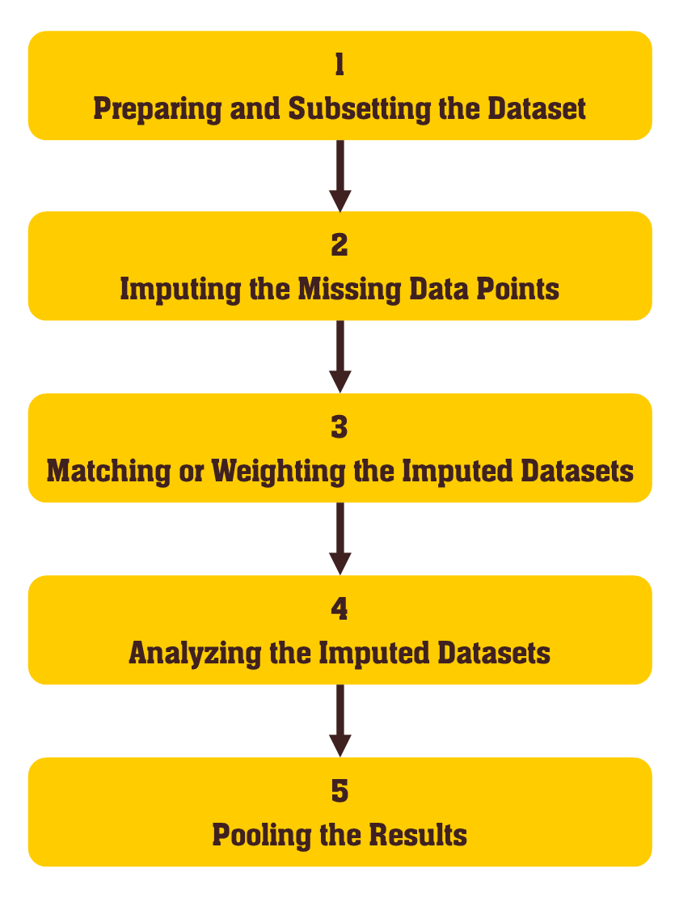

# MatchIt.mice 

<!-- badges: start -->
#### Matching Multiply Imputed Datasets
<!-- badges: end -->

[](https://cran.r-project.org/package=MatchIt.mice)
[](https://github.com/FarhadPishgar/MatchIt.mice)

## Introduction

One of the major issues in the matching procedures is the presence of missing data points, given the fact that matching relies on the predictions from a logistic regression model and these predictions cannot be made for individuals with at least one missing data point. Despite the standard approach of the complete case analyses (excluding individuals with missing data points from the final analysis), adopting algorithms to multiply impute the missing data points is growing as a popular alternative.

Although there are different approaches for combing the imputed information before or after the matching procedure, as [Leyrat et al.](https://www.ncbi.nlm.nih.gov/pubmed/28573919) mentioned, combining the treatment effects estimated on each matched imputed dataset (rather than combing the imputed covariate values or combing the matching model predictions on each imputed dataset) seems to reflect the multiple imputation philosophy better, by applying the full analysis strategy on each matched imputed dataset and providing good balancing properties between control and treatment groups.

There are several popular R packages for imputing the missing data points, including the [`mice`](https://cran.r-project.org/package=mice), [`Amelia`](https://cran.r-project.org/package=Amelia), [`missForest`](https://cran.r-project.org/package=missForest), [`Hmisc`](https://cran.r-project.org/package=Hmisc), and [`mi`](https://cran.r-project.org/package=mi) packages, and among these, the [`mice`](https://cran.r-project.org/package=mice) package is a widely accepted option for imputing the ignorable missing data points. The [`MatchIt.mice`](https://cran.r-project.org/package=MatchIt.mice) package simplifies the process of matching the imputed datasets by the [`mice`](https://cran.r-project.org/package=mice) package and selects matched samples from the control and treatment groups, performs complete data analysis, and pools the obtained results on each imputed dataset by this package according to Rubin’s rules.

## Installation

The [`MatchIt.mice`](https://cran.r-project.org/package=MatchIt.mice) package can be installed from the Comprehensive R Archive Network (CRAN) repository as follows:

``` r
install.packages("MatchIt.mice")
```

The latest (though unstable) version of the package can be installed from GitHub as follows:

``` r
devtools::install_github(repo = "FarhadPishgar/MatchIt.mice")
```

## Suggested Workflow

#### Step 0 - Reading this manual

Implementing multiple imputation algorithms before matching procedures or before estimating inverse propensity score weights for each individual may seem to be a time-consuming task. This suggested workflow tries to simplify this complex task into 5 steps:

<p align="center">
  
</p>

#### Step 1 - Preparing and Subsetting the Dataset

The original dataset may include several variables that are not intended to be included in the multiple imputation procedure (e.g. the `ID` variable in the `handoa` dataset). Hence, the dataset should be subsetted before the imputation procedure (the excluded variables can be returned to the imputed datasets after the multiple imputation procedure using the `cbind()` function, please see the [`mice`](https://cran.r-project.org/package=mice) package reference manual for details). In this suggested workflow, this step has been skipped.

The the [`MatchIt.mice`](https://cran.r-project.org/package=MatchIt.mice) package and `handoa` dataset (included in the [`MatchIt.mice`](https://cran.r-project.org/package=MatchIt.mice) package) are loaded:

``` r
library(MatchIt.mice, warn.conflicts = FALSE)

data(handoa)
```

#### Step 2 - Imputing the Missing Data Points

The [`mice`](https://cran.r-project.org/package=mice) package and its main function, `mice()`, provides several options for implementing a good practice of multiple imputation (there are several technical points that should be considered in this regard, please see the [`mice`](https://cran.r-project.org/package=mice) package reference manual for details):

``` r
datasets <- mice(handoa, m = 5, maxit = 10,
                 method = c("", "", "", "mean", "polyreg", "logreg", "", ""))
```


The output of this function will be saved in a `mids` class object (`datasets` here).

#### Step 3 - Matching or Weighting the Imputed Datasets

The [`MatchIt.mice`](https://cran.r-project.org/package=MatchIt.mice) package provides the essential tools for selecting matched samples from treatment and control groups of each imputed datasets (saved in the `datasets` object) or estimating inverse propensity score weights for each individual in these datasets:

*Matching Imputed Datasets*

``` r
matcheddatasets <- matchitmice(HANDOA ~ SEX + AGE + BMI, datasets, ratio = 3, caliper  =  0.05)
```

The output of the `matchitmice()` function will be saved in an object of the `mimids` class (`matcheddatasets` here). The `plot()`, `print()`, and `summary()` functions can be used to review detailed descriptions of these objects. Each of these objects includes data on:
1.	Matched datasets compiled in a `mids` class object,
2.	Matching model of the imputed datasets, 
3.	The method used for the matching procedure (`nearest` or `exact`), and
4.	The matched imputed datasets

*Weighting Imputed Datasets*

``` r
weighteddatasets <- weightitmice(HANDOA ~ SEX + AGE + BMI, datasets)
```

The output of the `weightitmice()` function will be saved in an object of the `wimids` class (`weighteddatasets` here). The `plot()`, `print()`, and `summary()` functions can be used to review detailed descriptions of these objects. Each of these objects includes data on:
1.	Weighted datasets compiled in a `mids` class object,
2.	Matching model of the imputed datasets,
3.	The method used for the matching procedure (always `nearest`), and
4.	The weighted imputed datasets

#### Step 4 - Analyzing the Imputed Datasets

The outputs of the `matchitmice()` and `weightitmice()` functions (`matcheddatasets` and `weighteddatasets` here, respectively) can be used for the complete data analysis on each matched or weighted imputed dataset:

``` r
matchedresults <- with(data = matcheddatasets,
                       exp = glm(HANDOA ~ SMOKING,
                                 na.action = na.omit, family = binomial))

weightedresults <- with(data = weighteddatasets,
                        exp = glm(HANDOA ~ SMOKING, weights = inverse.weights,
                                  na.action = na.omit, family = binomial))
```


#### Step 5 - Pooling the Results

The results one each (matched or weighted) imputed dataset can be pooled using the `pool()` function:

``` r
print(pool(matchedresults))

print(pool(weightedresults))
```

## Acknowledgments
I would like to thanks the CRAN team members for their comments and technical support. This package relies on the following packages, and please cite their reference manuals and vignettes in your work besides citing reference manual of this package:
1. [`MatchIt`](https://cran.r-project.org/package=MatchIt) package
2. [`mice`](https://cran.r-project.org/package=mice) package

## Author
Farhad Pishgar

[](https://twitter.com/FarhadPishgar)
